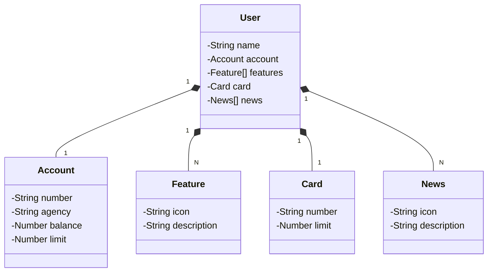

# Desafio DIO: API RESTful com Java e Spring Boot

API RESTful baseada em um aplicativo bancário construída em Java 22 com Spring Boot 3.

[Projeto de Referência](https://github.com/digitalinnovationone/santander-dev-week-2023-api/tree/main)

##

<h3 align=center>Diagrama de Classes (Domínio da API)</h3>

##

<h3>💻 Tecnologias</h3>

